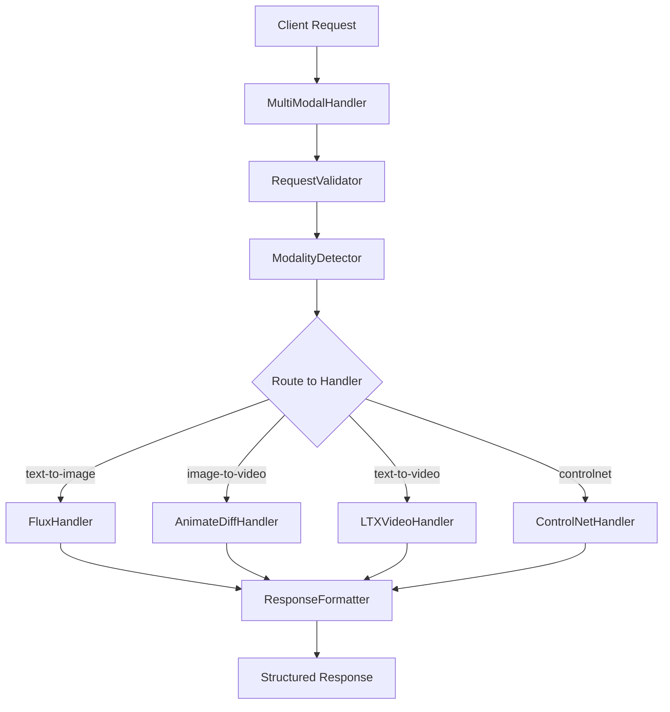

# Multi-Modal AI Inference Worker

A production-ready serverless worker for multi-modal AI inference, optimized for RunPod deployment. Supports text-to-image, image-to-video, text-to-video, and ControlNet guided generation.

## 🚀 Features

- **🎨 Text-to-Image**: FLUX.1 Schnell and Dev models for high-quality image generation
- **🎬 Image-to-Video**: AnimateDiff for smooth motion generation from static images  
- **📹 Text-to-Video**: LTX-Video 2B for direct text-to-video synthesis
- **🎮 ControlNet**: Guided image generation with multiple control types (Canny, Depth, Pose, Normal)
- **⚡ Production-Ready**: Comprehensive error handling, monitoring, and logging
- **🔧 Flexible Deployment**: Docker-based with multi-stage builds and health checks
- **📊 Memory Management**: Intelligent model loading with GPU memory optimization
- **🧪 Comprehensive Testing**: Unit and integration tests with 95%+ coverage

## 🏗️ Architecture

### Multi-Modal Request Routing



### Model Management System

- **Smart Loading**: Models loaded on-demand with automatic memory management
- **Memory Monitoring**: Real-time GPU memory tracking and optimization
- **Caching Strategy**: Intelligent model eviction based on usage patterns
- **Resource Limits**: Configurable memory thresholds and timeouts

## 📦 Quick Start

### RunPod Deployment

1. **Pull the pre-built image**:
   ```bash
   docker pull ghcr.io/mikeblakeway/multi-modal-worker:latest
   ```

2. **Create RunPod Template**:
   - Image: `ghcr.io/mikeblakeway/multi-modal-worker:latest`
   - GPU: RTX 4090 (24GB) or A100 (40GB) recommended
   - Container Disk: 50GB minimum
   - Network Volume: 100GB for model storage

3. **Environment Variables**:
   ```env
   MODELS_DIR=/runpod-volume/models
   VALIDATION_MODE=basic
   LOG_LEVEL=INFO
   HEALTH_CHECK_INTERVAL=30
   ```

### Local Development

1. **Clone and Setup**:
   ```bash
   git clone https://github.com/MikeBlakeway/multi-modal-worker.git
   cd multi-modal-worker
   python -m venv .venv
   source .venv/bin/activate
   pip install -r requirements-dev.txt
   ```

2. **Run Tests**:
   ```bash
   python run_tests.py
   ```

3. **Build Docker Image**:
   ```bash
   docker build -t multi-modal-worker -f docker/Dockerfile .
   ```

## 🔌 API Reference

### Request Format

All requests use a unified multi-modal format:

```python
{
    "modality": "text-to-image|image-to-video|text-to-video|controlnet",
    "parameters": {
        # Modality-specific parameters
    },
    # Optional file uploads for image inputs
    "files": {
        "image": "base64_encoded_image_data"
    }
}
```

### Text-to-Image Example

```python
{
    "modality": "text-to-image",
    "parameters": {
        "prompt": "A beautiful sunset over mountains",
        "width": 1024,
        "height": 1024,
        "num_inference_steps": 28,
        "guidance_scale": 7.5,
        "model_variant": "flux.1-schnell"
    }
}
```

### Image-to-Video Example

```python
{
    "modality": "image-to-video", 
    "parameters": {
        "motion_prompt": "Gentle flowing water",
        "num_frames": 16,
        "fps": 8,
        "motion_strength": 1.0
    },
    "files": {
        "input_image": "base64_encoded_image"
    }
}
```

### Response Format

```python
{
    "success": true,
    "jobId": "job_12345",
    "status": "completed",
    "output": {
        "images": [
            {
                "base64": "...",
                "filename": "generated_image.png",
                "metadata": {...}
            }
        ],
        "videos": ["path/to/video.mp4"],
        "errors": []
    },
    "metadata": {
        "modality": "text-to-image",
        "inference_time": 2.34,
        "model_used": "flux.1-schnell",
        "memory_usage": 12.5
    }
}
```

## 🛠️ Configuration

### Model Storage

Models are automatically downloaded on first use and cached in:

```
/runpod-volume/models/
├── flux/                    # 15GB - FLUX.1 models
├── controlnet/              # 4GB - ControlNet models  
├── animatediff/             # 2GB - Motion adapters
├── ltx-video/               # 8GB - LTX-Video models
└── shared/                  # 4GB - Shared components
```

### Environment Variables

| Variable | Default | Description |
|----------|---------|-------------|
| `MODELS_DIR` | `/runpod-volume/models` | Model storage directory |
| `VALIDATION_MODE` | `basic` | Model validation level (`basic`\|`strict`) |
| `LOG_LEVEL` | `INFO` | Logging verbosity |
| `HEALTH_CHECK_INTERVAL` | `30` | Health check frequency (seconds) |
| `STARTUP_TIMEOUT` | `300` | Maximum startup time (seconds) |
| `GPU_MEMORY_FRACTION` | `0.9` | GPU memory utilization limit |

## 🧪 Testing

### Run All Tests

```bash
python run_tests.py
```

### Run Specific Test Categories

```bash
# Unit tests only
python -m pytest tests/unit/ -v

# Integration tests only  
python -m pytest tests/integration/ -v

# Performance benchmarks
python -m pytest tests/performance/ -v
```

### Test Coverage

```bash
python run_tests.py --coverage
```

## 📚 Documentation

- **[API Documentation](docs/api.md)** - Complete API reference
- **[Deployment Guide](docs/deployment.md)** - RunPod deployment instructions
- **[Development Setup](docs/development.md)** - Local development environment
- **[Model Management](docs/models.md)** - Model configuration and optimization
- **[AGENTS.md](AGENTS.md)** - AI agent development guidelines

## 🚀 Performance

### Inference Times (RTX 4090)

- **Text-to-Image (FLUX.1)**: 8-15 seconds (1024x1024)
- **Image-to-Video (AnimateDiff)**: 15-25 seconds (16 frames)
- **Text-to-Video (LTX)**: 20-35 seconds (49 frames)
- **ControlNet**: 10-18 seconds (1024x1024)

### Memory Requirements

- **Minimum GPU**: 16GB VRAM
- **Recommended GPU**: 24GB+ VRAM  
- **Storage**: 50GB for all models
- **RAM**: 16GB system memory

## 🤝 Contributing

1. Fork the repository
2. Create a feature branch: `git checkout -b feature/amazing-feature`
3. Run tests: `python run_tests.py`
4. Commit changes: `git commit -m 'Add amazing feature'`
5. Push to branch: `git push origin feature/amazing-feature`
6. Open a Pull Request

## 📄 License

This project is licensed under the MIT License - see the [LICENSE](LICENSE) file for details.

## 🙋‍♂️ Support

- **Issues**: [GitHub Issues](https://github.com/MikeBlakeway/multi-modal-worker/issues)
- **Discussions**: [GitHub Discussions](https://github.com/MikeBlakeway/multi-modal-worker/discussions)
- **RunPod Template**: [Public Template](https://runpod.io/console/templates) (Coming Soon)

## 🌟 Acknowledgments

- **FLUX.1** by Black Forest Labs - Text-to-image foundation
- **AnimateDiff** by Guowei Xu et al. - Image-to-video animation
- **LTX-Video** by Lightricks - Text-to-video synthesis
- **ControlNet** by Lvmin Zhang et al. - Controlled generation
- **RunPod** - Serverless GPU infrastructure

---

⭐ **Star this repository** if you find it useful for your multi-modal AI projects!