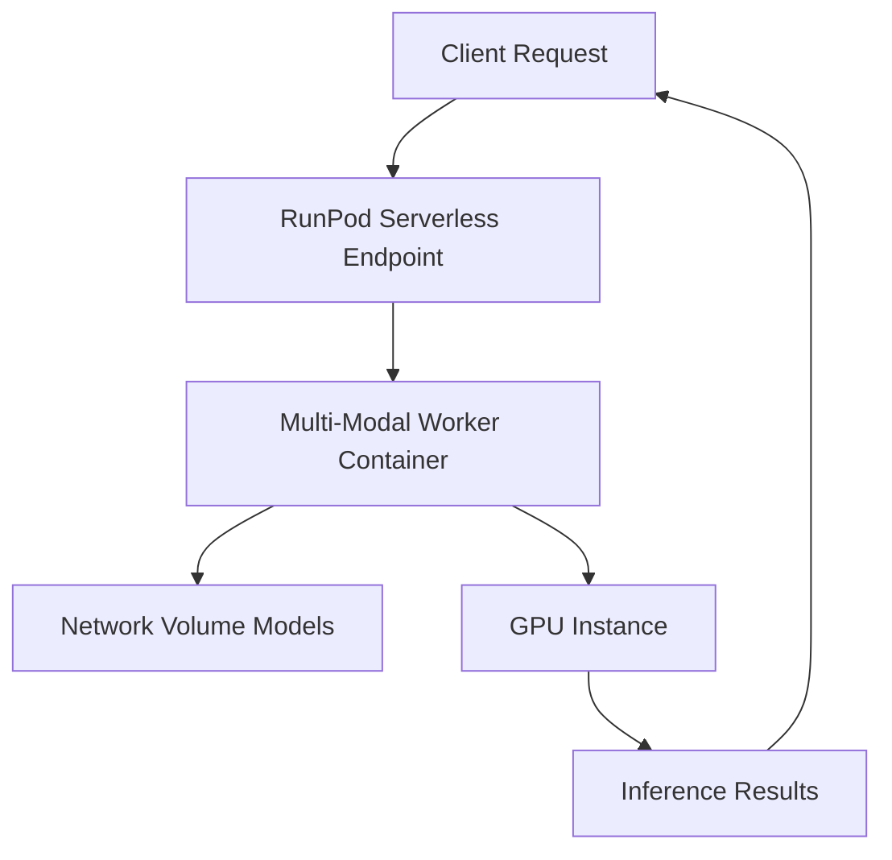

# Multi-Modal Inference Worker Deployment Guide

## Overview

This guide provides comprehensive instructions for deploying the Multi-Modal Inference Worker on RunPod's serverless platform. The worker supports multiple AI modalities including text-to-image, image-to-video, text-to-video, inpainting, ControlNet, and camera control functionality.

## Prerequisites

### System Requirements

- RunPod account with serverless access
- Docker environment for local builds
- Git for source code management
- Network Volume with at least 80GB capacity (recommended 100GB)

### Access Requirements

- RunPod API key with serverless permissions
- Network Volume credentials for model storage
- Container registry access (Docker Hub or GitHub Container Registry)

## Deployment Architecture

### Infrastructure Components



### Model Storage Layout

```bash
/workspace/models/
├── flux/                    # 15GB - FLUX.1 Schnell fp8
├── controlnet/              # 4GB - Canny + Depth models
├── animatediff/             # 2GB - Motion adapter
├── video_backbones/         # 8GB - LTX-Video 2B
├── inpaint/                 # 6GB - SDXL Inpainting
├── camera/                  # 1GB - CameraCtrl
└── shared/                  # 4GB - VAE, tokenizers
```

## Pre-Deployment Setup

### 1. Network Volume Preparation

```bash
# Create and configure Network Volume (via RunPod console)
# Volume size: 100GB (recommended)
# Region: Same as serverless deployment region
# Access: Read/Write
```

### 2. Model Download and Organization

```bash
# TODO: Model download script will be implemented in Phase 2
# This section will be updated with specific model download commands
```

### 3. Container Build and Registry Push

```bash
# Build multi-modal worker container
cd workers/multi-model-worker
docker build -t multi-modal-worker:latest -f docker/Dockerfile .

# Tag and push to registry
docker tag multi-modal-worker:latest your-registry/multi-modal-worker:v0.1.0
docker push your-registry/multi-modal-worker:v0.1.0
```

## RunPod Template Configuration

### Template Specification

```yaml
name: 'Multi-Modal Inference Worker'
image: 'your-registry/multi-modal-worker:v0.1.0'
docker_start_cmd: 'python src/main.py'

# Container configuration
container_disk_in_gb: 20
volume_in_gb: 100
volume_mount_path: '/workspace'

# Runtime settings
env_vars:
  - MODEL_CACHE_DIR: '/workspace/models'
  - RUNPOD_WORKER: 'true'
  - TORCH_CACHE: '/workspace/cache'

# Scaling configuration
min_workers: 0
max_workers: 3
idle_timeout: 60
flashboot: true

# Hardware requirements
gpu_type: 'RTX A4000 | RTX 4090 | A100'
memory_gb: 24
vcpu_count: 8
```

### Advanced Configuration Options

```yaml
# Performance optimization
advanced_config:
  # FlashBoot for faster cold starts
  flashboot_enabled: true

  # Automatic scaling
  auto_scale:
    scale_up_threshold: 0.8
    scale_down_threshold: 0.2
    max_scale_up_rate: 2

  # Health monitoring
  health_check:
    enabled: true
    endpoint: '/health'
    interval_seconds: 30
```

## Deployment Process

### Step 1: Create RunPod Template

1. Navigate to RunPod Console → Templates
2. Click "New Template"
3. Configure template with above specifications
4. Save template

### Step 2: Deploy Serverless Endpoint

1. Navigate to Serverless → Endpoints
2. Click "New Endpoint"
3. Select created template
4. Configure scaling settings:
   - Min Workers: 0 (cost optimization)
   - Max Workers: 3 (performance)
   - Idle Timeout: 60 seconds
5. Enable FlashBoot
6. Deploy endpoint

### Step 3: Configure Network Volume

1. Attach Network Volume to template
2. Mount at `/workspace`
3. Verify model directory structure
4. Test volume connectivity

### Step 4: Validation and Testing

```bash
# Test endpoint health
curl -X POST https://your-endpoint.runpod.io/health

# Test basic inference
curl -X POST https://your-endpoint.runpod.io/runsync \
  -H "Content-Type: application/json" \
  -d '{
    "input": {
      "modality": "text-to-image",
      "prompt": "test image generation",
      "steps": 4
    }
  }'
```

## Environment Variables

### Required Variables

| Variable          | Description             | Example             |
| ----------------- | ----------------------- | ------------------- |
| `MODEL_CACHE_DIR` | Model storage directory | `/workspace/models` |
| `RUNPOD_WORKER`   | RunPod worker flag      | `true`              |
| `TORCH_CACHE`     | PyTorch cache directory | `/workspace/cache`  |

### Optional Variables

| Variable              | Description                | Default |
| --------------------- | -------------------------- | ------- |
| `LOG_LEVEL`           | Logging level              | `INFO`  |
| `MAX_INFERENCE_TIME`  | Timeout for inference      | `120`   |
| `MEMORY_OPTIMIZATION` | Enable memory optimization | `true`  |
| `GPU_MEMORY_FRACTION` | GPU memory limit           | `0.95`  |

## Monitoring and Maintenance

### Performance Monitoring

- **Inference Time**: Track per-modality performance
- **Memory Usage**: Monitor GPU and system memory
- **Error Rates**: Track failed inference requests
- **Scaling Metrics**: Monitor auto-scaling behavior

### Log Management

```bash
# View worker logs via RunPod console
# Logs are automatically collected and displayed
# Configure log levels via LOG_LEVEL environment variable
```

### Health Checks

```python
# Health check endpoint (implemented in main.py)
GET /health
Response: {"status": "healthy", "models_loaded": [...]}
```

## Troubleshooting

### Common Issues

#### Issue: Container fails to start

**Symptoms**: Container exits immediately after start
**Solutions**:

- Check Docker image build logs
- Verify all dependencies in requirements.txt
- Ensure Network Volume is properly mounted

#### Issue: Model loading failures

**Symptoms**: Inference requests fail with model errors
**Solutions**:

- Verify model files exist in Network Volume
- Check model file permissions and integrity
- Monitor GPU memory usage during model loading

#### Issue: Slow cold starts

**Symptoms**: Long wait times for first inference
**Solutions**:

- Enable FlashBoot in template configuration
- Optimize Docker image size and layers
- Consider pre-loading critical models

#### Issue: Out of memory errors

**Symptoms**: CUDA out of memory during inference
**Solutions**:

- Enable memory optimization features
- Reduce batch sizes or model precision
- Implement smart model eviction

### Performance Optimization

#### Model Loading Optimization

```python
# Implement lazy loading and smart eviction
# Use fp8 quantization where possible
# Share components between modalities
```

#### Memory Management

```python
# Configure memory optimization
import torch
torch.cuda.empty_cache()  # Clear unused memory
torch.backends.cudnn.benchmark = True  # Optimize CUDNN
```

## Security Considerations

### Access Control

- Use RunPod API keys for authentication
- Restrict Network Volume access to necessary workers
- Implement request validation and sanitization

### Data Privacy

- Process data in-memory when possible
- Clear temporary files after inference
- Use secure communication channels (HTTPS)

### Model Security

- Verify model file integrity during download
- Use checksums to validate model files
- Implement access logging for model usage

## Cost Optimization

### Scaling Strategy

```yaml
# Recommended scaling settings for cost optimization
min_workers: 0 # No idle costs
max_workers: 3 # Reasonable capacity
idle_timeout: 60 # Quick scale-down
flashboot: true # Faster scale-up
```

### Usage Monitoring

- Monitor per-request costs
- Track scaling patterns and optimize
- Set up alerts for cost thresholds
- Regular review of usage patterns

## Rollback Procedures

### Version Rollback

1. Keep previous container image versions
2. Update template to previous image tag
3. Redeploy endpoint with previous template
4. Verify functionality with test requests

### Emergency Procedures

1. Disable endpoint to stop new requests
2. Diagnose issue via logs and monitoring
3. Apply fix or rollback as appropriate
4. Re-enable endpoint and validate

## Future Enhancements

### Planned Improvements

- **Phase 2**: Full model implementation and optimization
- **Phase 3**: Advanced performance tuning
- **Phase 4**: Production monitoring and alerting
- **Phase 5**: Auto-scaling optimization

### Monitoring Integration

- Integration with existing Media Labs monitoring
- Custom metrics for multi-modal performance
- Alert integration with incident management

---

_This deployment guide will be updated as implementation progresses through the defined phases._
